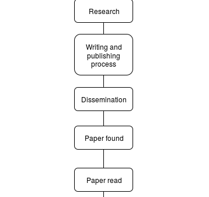
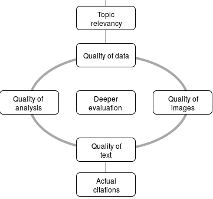
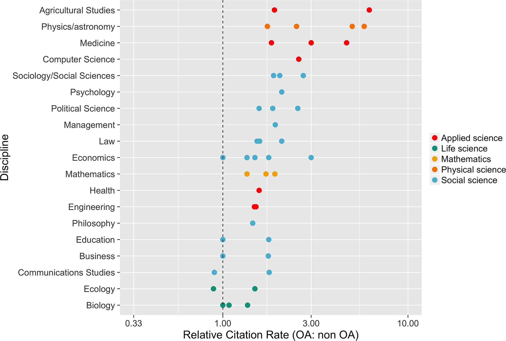

# INTRODUCTION

----

## a bit about me  

- I am a hydrogeologist, working mostly on hydrochemistry using data mining and  machine learning approaches.
- I work as a lecturer/researcher at the [Faculty of Earth Sciences and Technology](fitb.itb.ac.id), ITB.
- I spent all of my educations in ITB
    - S1: 1994 - 1998
    - S2: 1999 - 2001
    - S3: 2005 - 2009

----

## a bit about me  

- I support open science in anyway I can. As my side project, I serve as [ORCID](orcid.org) and [OSF](osf.io) ambassador.
- I tweet as "@dasaptaerwin"


----

## definition | #openscience as a movement

From [Wikipedia](https://en.wikipedia.org/wiki/Open_science)

```
Open science is the movement to make 
scientific research, data and dissemination 
accessible to all levels of an inquiring 
society, amateur or professional.
```
----

## definition | #openscience as a (daily) practice

From [FOSTER](https://www.fosteropenscience.eu/foster-taxonomy/open-science-definition)

```
Open Science is the practice of science 
in such a way that others can collaborate 
and contribute, where research data, lab notes 
and other research processes are freely 
available, under terms that enable reuse, 
redistribution and reproduction of the 
research and its underlying data and methods. 
```

----

## definition | #openscience as common goals

According to [Openscience.org](http://www.openscience.org/blog/?p=269)

```
... four fundamental goals:

- Transparency in experimental methodology, observation, and collection of data.
- Public availability and reusability of scientific data.
- Public accessibility and transparency of scientific communication.
- Using web-based tools to facilitate scientific collaboration.
```
----

# what's going on right now in Indonesia

----

## high demands on:

  - international publications
  - citations
  - research transparency and accountability 

----

## misuse of scientific databases

  - journals indexed by Scopus, WoS   = **reputable journals**
  - articles indexed by Scopus, WoS   = **reputable articles**
  - authors whose name on Scopus, WoS = **reputable authors/researchers**

Hence he/she deserves grants/incentives.

----

## do you think I am not into quality?

  - well you're not the first to throw that question
  - **yes**, I believe that good science relates to good quality
  - but, **no** I don't believe that good science relates to:
      - **indexing** companies
      - **high** expenses
      - **rocket** science
  
----

## and do you know what are our drawbacks?

  - language barrier vs int'l publications
  - poor dissemination vs citations
  - closed-loop network vs research transparency and accountability 

----

## and how's the actual workflow?

<center><center>

----

## and how's the actual workflow?

<center><center>

----

# benefits of #openscience

The benefits according to [Whyopenresearch](http://whyopenresearch.org)

<div align="center">

</div>

----

## how #openscience helps scholars

According to [McKiernan et al., 2016](https://elifesciences.org/content/5/e16800)

Follow her [@mckiernan13](https://twitter.com/emckiernan13)

----

## openscience means ...

- more **visibility** of their works: in open access journals, blogs, preprint servers, and repositories, attaching doi (digital object identifier) for persistent address;
- more **citations**: by applying metrics like [Altmetrics](altmetrics.org);
- harvest more **inputs**: via comments and reviewing facilities like [Publons](publons.com); or via scientific publishing platform like [ScienceOpen](scienceopen.com);

----

## what does it take to get more citations? 

Shifted perpective:

- **open access** articles get more citations;
- articles with **open data** get more citations;
- articles with **open method** get more citations;

----

## relative citation of articles in OA/non-OA journals (McKiernan et al., 2016)

<div align="center">

</div>

----

## Table of preprint servers and general repositories accepting preprints

Pls go to this [link](http://dx.doi.org/10.7554/eLife.16800.003).

We will see [ArXiv](arxiv.org), [BiorXiv](biorxiv.org), [SocarXiv](https://osf.io/view/socarxiv/), [Figshare](figshare.com), [Zenodo](zenodo.org), and [OpenScienceFramework](osf.io).

----

## The (obvious) benefits

- **more exposures**: even to those who don't have access to journal subscription
- **reproducibility**: allowing others to reproduce your work and validate it; **replicability**: allowing others to apply your work (methods) to their own work
- **transparent and accountable**: allowing grant funder to monitor your progress


----

# the innovations of openscience

----

## `post publication peer review`

- publish first and getting comments afterwards, example: [ScienceOpen](scienceopen.com), [F1000Research](F1000Research.com), [ESSD](http://www.earth-syst-sci-data-discuss.net/);

----

## `open review system`

- no blind review 
- review as a quality improvement process
- review is not a gate keeper

----

## alternative article's metrics: beyond Impact Factor

- Now we do have [Altmetrics](Altmetrics.com), to measure online conversations on your article, [example](https://www.altmetric.com/details/2500334?src=bookmarklet);
- Or you can put on your page on [ImpactStory](ImpactStory.org),  [example](https://impactstory.org/u/0000-0002-1526-0863/);
- Since [ResearchGate](researchgate.net) social media is also very popular, why don't you put your works there and get scored.

----

## collaborate, collaborative, collaboration

You can't do all by yourself. That's why now we have collaborative platforms:

- writing platforms, like: [Overleaf](overleaf.com), [Authorea](authorea.com), [Papeeria](Papeeria.com) 
- research platforms: [OSF](osf.io)
- publishing platforms: [ScienceOpen](ScienceOpen.com).

----

# Recommended practices (my own) 

----

## no 1 hold on to your **rights**: my research is mine and mine only

- I don't follow legacy system: 
    - I do the research
    - I write the paper and submit it
    - somebody reviews it (with no pay)
    - I revise the paper
    - publisher says "accepted"
    - ~~you sign the transfer copyright agreement~~
    - ~~you **loose** the right over your own paper~~

----

## no 1 hold on to your **rights**: my research is mine and mine only

- I choose open access journals to publish my work; 
- I use independent "white list", like [DOAJ](doaj.org) list as reference;   
- or self archiving, eg: [blogs](derwinirawan.wordpress.com), [OSF](osf.io), [Figshare](figshare.com), [Zenodo](zenodo.org), Dataverse network. 

----

## no 2 science evolves, publishing means opportunity 

- I don't wait until the final phase, 
- I publish my work from the very begining. I made project proposal online. [Example](https://figshare.com/articles/Ecohydrological_characterization_on_Cikapundung_watershed_a_proposal_--_version_1_/3978381). 
- this way I can take the readers into my scientific story and invite their collaboration. [Example](https://goo.gl/9Bnp5E).

----

## no 3 google is my best friend

- post my reports (academic, projects) in open repository. [example1](https://figshare.com/articles/The_hydrochemistry_of_Mount_Ciremai_groundwater_system_Kuningan_West_Java_Indonesia/4056129), [example2](https://goo.gl/YiDYJV);
- post my data as one of research output in open repo and cite it in my paper. [Example1](https://goo.gl/4nNzkr),[Example2](https://goo.gl/AbeKjy). 

----

# closing

----

## take home messages

- protect your rights by submitting to open access media;
- releasing data, method, and using open source software to maintain the reproducibility aspect
- if it's not online then it's not there

----

## thank you and please connect

- d _ erwin _ irawan(@)yahoodotcom
- [twitter](www.twitter.com/dasaptaerwin)
- [blog1](dasaptaerwin.wordpress.com) and [blog2](dasaptaerwin.net/wp)
